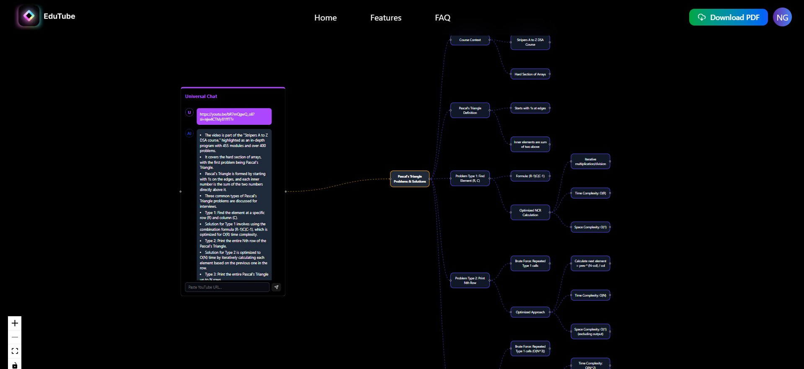

# 🧠 Edutube AI

<p align="center">  </p> 

<p align="center"> <strong>Summarize YouTube videos in seconds with AI-powered Mind Mapping!</strong><br /> Edutube AI is an intelligent, intuitive web app that transforms YouTube video content into organized, visual mindmaps and concise notes within seconds. Built with Next.js, ReactFlow, and MongoDB, it helps learners, students, and professionals save time while retaining knowledge efficiently. </p>

---

## ✨ Features

- 🔐 **Authentication** – Secure login & signup flow  
- 🗺️ **Mindmap Builder** – Drag-and-drop nodes, powered by ReactFlow  
- 📝 **AI Summarization** – Convert conversations into concise notes  
- 📄 **PDF Export** – Save your mindmaps as shareable PDFs  
- 📊 **Dashboard** – Access and manage your saved mindmaps  
- 🎨 **Beautiful UI** – Tailored with Tailwind CSS & shadcn/ui  

---

## 🖼️ Screenshots

<p align="center">
  
</p>

---

## 🛠️ Tech Stack

- ⚡ **Next.js 14** – App Router, SSR  
- ⚛️ **React 18** – UI components  
- 🎨 **Tailwind CSS + shadcn/ui** – Styling  
- 🧩 **ReactFlow** – Interactive Mindmaps  
- 🍃 **MongoDB** – Database  
- 🔑 **NextAuth.js / Custom Auth** – Authentication  
- 📦 **TypeScript** – Type safety  

---

## 🚀 Getting Started

### 1. Clone the repo
```bash
git clone https://github.com/your-username/EduTube-AI.git
cd EduTube-AI
```

### 2. Install dependencies
```bash
npm install
# or
yarn install
```

### 3. Set up environment variables
Create a **.env.local** file:
```env
NEXT_PUBLIC_APP_URL=http://localhost:3000
MONGODB_URI=your-mongodb-connection
NEXTAUTH_SECRET=your-secret
```

### 4. Run the development server
```bash
npm run dev
```

App will be live at **http://localhost:3000**

---

## 📂 Folder Structure
```
├── public/
│   ├── assets/        # Logos, screenshots
├── src/
│   ├── app/           # Next.js App Router pages
│   ├── components/    # Reusable UI components
│   ├── lib/           # Helpers & utilities
│   ├── styles/        # Tailwind styles
```

---

## 🤝 Contributing

1. Fork the repo  
2. Create your feature branch (`git checkout -b feature/AmazingFeature`)  
3. Commit changes (`git commit -m 'Add some feature'`)  
4. Push branch (`git push origin feature/AmazingFeature`)  
5. Open a Pull Request  

---

## 📜 License

Distributed under the MIT License.  
See `LICENSE` for more information.  
