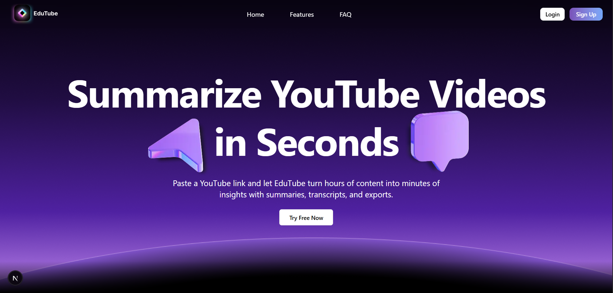

# 🧠 Edutube AI

<p align="center">  </p> 

<p align="center"> <strong>Summarize YouTube videos in seconds with AI-powered Mind Mapping!</strong><br /> Edutube AI is an intelligent, intuitive web app that transforms YouTube video content into organized, visual mindmaps and concise notes within seconds. Built with Next.js, ReactFlow, and MongoDB, it helps learners, students, and professionals save time while retaining knowledge efficiently. </p>

---

## ✨ Features

- 🔐 **Authentication** – Secure login & signup flow  
- 🗺️ **Mindmap Builder** – Drag-and-drop nodes, powered by ReactFlow  
- 📝 **AI Summarization** – Convert conversations into concise notes  
- 📄 **PDF Export** – Save your Summary as shareable PDFs  
- 📊 **Dashboard** – Access and manage your saved mindmaps  
- 🎨 **Beautiful UI** – Tailored with Tailwind CSS & shadcn/ui  
- 🌐 **Automatic Language Detection & Summarization** – Edutube AI detects the language of the YouTube video automatically. Summaries are generated in English by default, regardless of the video’s original language.

- 💡 **How It Works**  
  1. Paste a YouTube URL.  
  2. AI detects the video’s language automatically.  
  3. Generates an English summary with bullet points and a mindmap.

---

## 🌟 Why Edutube AI?
- **Time Efficiency** – Quickly grasp key concepts without watching entire videos.  
- **Visual Learning** – Mindmaps enhance understanding and retention.  
- **AI-Powered** – Leverages advanced AI for accurate summarization.  
- **User-Friendly** – Intuitive interface for all users.  
- **Free to Use** – Accessible to everyone looking to learn smarter.

---

## 🖼️ Screenshots

<p align="center">
  
</p>

<p align="center">
  
</p>

---

## 🛠️ Tech Stack

- ⚡ **Next.js 15** – App Router, SSR  
- ⚛️ **React 19** – UI components  
- 🎨 **Tailwind CSS + shadcn/ui** – Styling  
- 🧩 **ReactFlow** – Interactive Mindmaps  
- 🍃 **MongoDB** – Database  
- 🔑 **JWT Auth** – Authentication  
- 📦 **TypeScript** – Type safety  

---

## 🚀 Getting Started

### 1. Clone the repo
```bash
git clone https://github.com/your-username/EduTube-AI.git
cd EduTube-AI
```

### 2. Install dependencies
```bash
npm install
# or
yarn install
```

### 3. Set up environment variables
Create a **.env.local** file:
```env
NEXT_PUBLIC_BASE_URL=http://localhost:3000
MONGO_URI=your-mongodb-connection
JWT_SECRET=your-secret
GOOGLE_CLIENT_ID=your-google-client-id
GOOGLE_CLIENT_SECRET=your-google-client-secret
GOOGLE_REDIRECT_URI=http://localhost:3000/api/google/callback
GITHUB_CLIENT_ID=your-github-client-id
GITHUB_CLIENT_SECRET=your-github-client-secret
GITHUB_REDIRECT_URI=http://localhost:3000/api/github/callback
GEMINI_API_KEY=your-gemini-api-key
RAPID_API_KEY=your-rapid-api-key
RAPID_API_HOST=your-rapid-api-host
Setup your own email credentials for production use.
```

### 4. Run the development server
```bash
npm run dev
```

App will be live at **http://localhost:3000**

---

## 📂 Folder Structure
```
├── public/
│   ├── assets/        # Logos, screenshots
├── src/
│   ├── app/           # Next.js App Router pages
│   ├── components/    # Reusable UI components
│   ├── lib/           # Helpers & utilities
│   ├── styles/        # Tailwind styles
```

---

## 🤝 Contributing

1. Fork the repo  
2. Create your feature branch (`git checkout -b feature/AmazingFeature`)  
3. Commit changes (`git commit -m 'Add some feature'`)  
4. Push branch (`git push origin feature/AmazingFeature`)  
5. Open a Pull Request  

---

## 📜 License

Distributed under the MIT License.  
See `LICENSE` for more information.  
